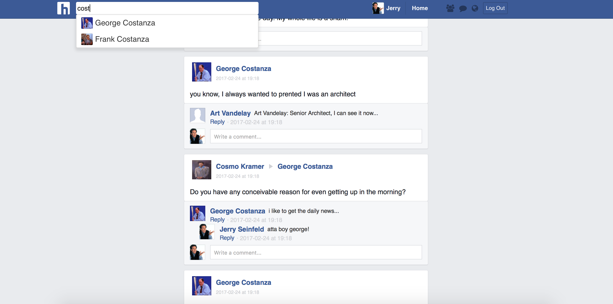

Humanbook is a social media app designed to mimic [facebook](https://www.facebook.com) in both look and feel. It was built using Ruby-on-Rails, PostgreSQL and React.js with a Redux architecture. Feel free to make an account and explore your social network, or use the guest login.

A live version of the site can be found [here](http://www.humanbook.us)

### Screenshots



### Features
  - Newsfeed of yours and your friends' recent posts
  - User profiles, complete with:
   + A timeline that yourself/friends can post to
   + Friends sidebar to easily access your friends' profiles
    + An about page editable with basic personal info
  - Search
  - Commenting on posts
   + With nested comments
  - Full editing and deletion of all posts/comments you have made

### Technical Details: Friending Backend
The lifeblood of humanbook is the friending experience, and creating a system that mimicked the robustness of facebook's was no small feat. At the database level, a friendship is represented by an entry in the aptly named `friendships` table which holds the foreign keys of both users. However, friendships implemented in this way are NOT bidirectional- meaning that there is a difference between making friend by sending them a request and accepting a request that was sent to you. In order to search for one's own friends, the `friendships` table must be traversed whilst searching for your own `id` in both columns for the `friender` as well as the `receiver`. This was accomplished using the following SQL query:

```SQL
SELECT
  users.*
FROM(
  SELECT
  CASE myfships.friender_id
  WHEN ? then myfships.receiver_id
    ELSE myfships.friender_id
  END as id
FROM(
  SELECT
    friendships.id, friender_id, receiver_id
  FROM
   friendships
   INNER JOIN
    users AS frienders ON friender_id = frienders.id
   INNER JOIN
    users AS receivers ON receiver_id = receivers.id
   WHERE receiver_id != ? AND friender_id != ?) AS myfships) AS friends
 INNER JOIN users on users.id = friends.id

```

An ActiveRecord relation made this much less verbose:
```ruby
def friends
  User
  .joins("INNER JOIN friendships ON friender_id = users.id OR receiver_id = users.id")
  .where("users.id != ? AND (friender_id = ? OR receiver_id = ?)", self.id, self.id, self.id)
end
```

Want to see how this webapp was planned? [Go to development README](./docs)
